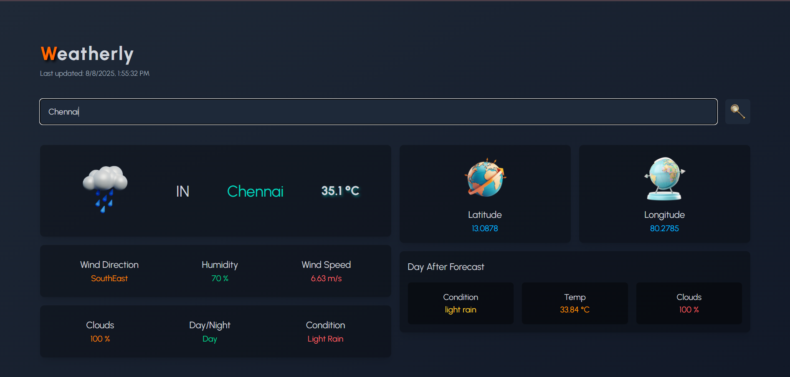

# 🌤️ Weather App

A responsive weather forecasting web app built with **React + Vite** and styled using **Tailwind CSS**. It allows users to search for the current weather of any city around the world.



---

## 🚀 Features

- 🌍 Search for any city
- 🌡️ Real-time temperature and weather data
- 🌥️ Dynamic weather icons based on conditions
- 🌓 Day and night mode detection
- 📱 Fully responsive UI

---

## 🛠️ Tech Stack

- ⚛️ React
- ⚡ Vite
- 🎨 Tailwind CSS
- 🌐 OpenWeatherMap API

---

## 📸 Screenshot


---

## 📦 Installation

```bash
git clone https://github.com/harikaran1033/Weather-app.git
cd Weather-app
npm install
npm run dev
